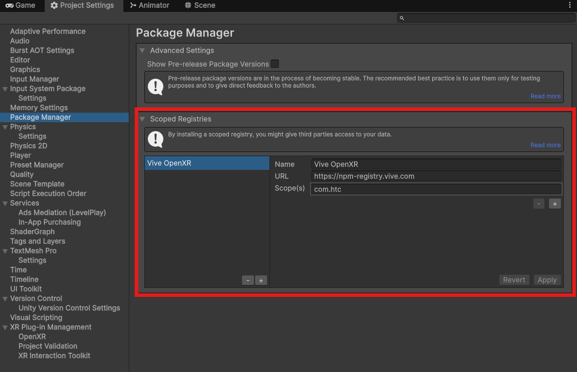
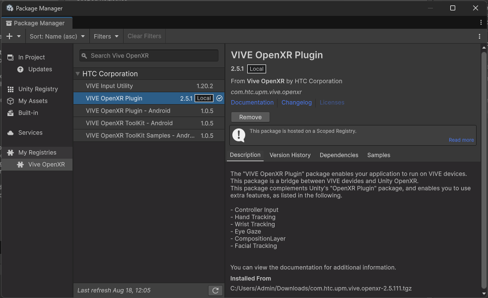
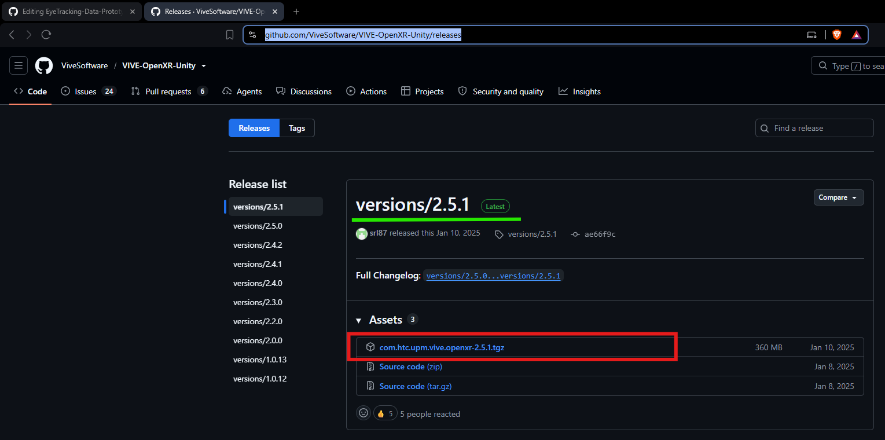
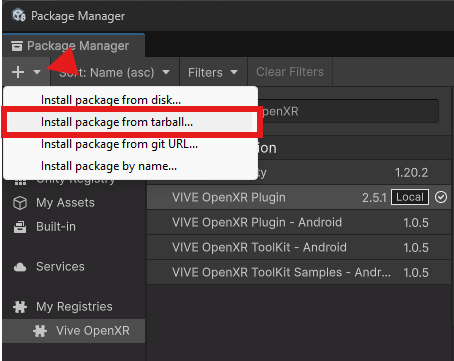
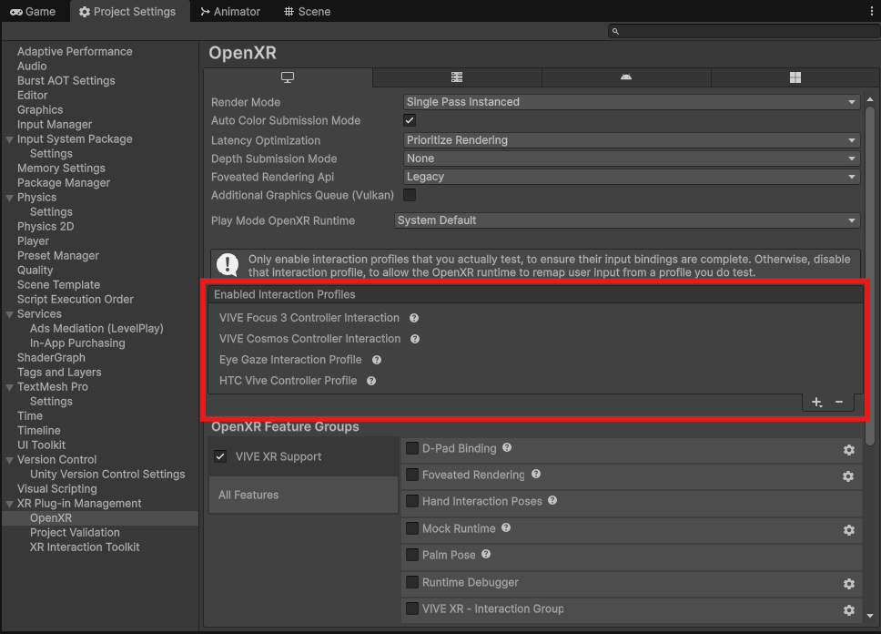
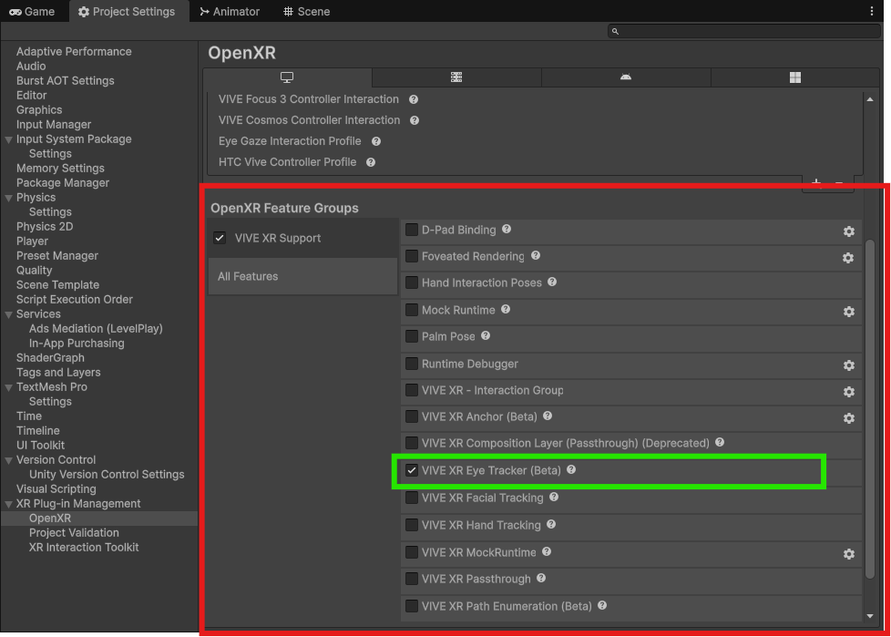

# Eye Tracking Data Prototype — Setup Guide

This guide explains how to set up and run the **Eye Tracking Data Prototype** in Unity with **HTC VIVE Focus Vision**.

Two setup methods are provided:

* **Option 1 — Manual Package Installation:** Install and configure the required packages manually.
* **Option 2 — Project Package Configuration:** Use the project's `Packages/manifest.json` and `Packages/packages-lock.json` to restore the required dependencies.

---

# Requirements

## Hardware

* HTC VIVE Focus Vision
* Compatible Windows PC
* USB connection or supported wireless connection to the headset

## Software

* Unity **2021.3 or newer**
* Unity Hub
* XR Interaction Toolkit
* VIVE OpenXR Plugin
* VIVE OpenXR package **2.5.1**
* OpenXR-compatible runtime

---

# Option 1 — Manual Package Installation

Use this method if you are setting up the project manually or if the package configuration is not being restored automatically.

## 1. Download and Open the Project

Download or clone the repository.

Open **Unity Hub** and add the project.

Select the project and open it using:

**Unity 2021.3 or newer**

Allow Unity to finish importing and compiling the project before continuing.

> **Important:** Use the Unity version specified by the project whenever possible. Opening the project with a different Unity version may cause package or project-setting changes.

---

## 2. Install XR Interaction Toolkit

Open:

**Window → Package Manager**

Search for:

**XR Interaction Toolkit**

Install the package.

After installation, allow Unity to finish importing the package.

---

# 3. Add the VIVE OpenXR Scoped Registry

Open:

**Edit → Project Settings → Package Manager**

Find:

**Scoped Registries**

Create a new registry with the following settings:

| Setting  | Value                           |
| -------- | ------------------------------- |
| Name     | `Vive OpenXR`                   |
| URL      | `https://npm-registry.vive.com` |
| Scope(s) | `com.htc`                       |

Click **Apply**.

### Scoped Registry Setup



---

# 4. Install VIVE OpenXR Plugin

Open:

**Window → Package Manager**

Change the package source to:

**My Registries**

Find:

**VIVE OpenXR Plugin**

Click:

**Install**

### VIVE OpenXR Plugin



Wait for Unity to finish importing the package.

---

# 5. Download VIVE OpenXR 2.5.1

Download **VIVE OpenXR 2.5.1** from the official VIVE OpenXR Unity releases:

https://github.com/ViveSoftware/VIVE-OpenXR-Unity/releases

Download the required `.tgz` package.

### Download Package



Keep the downloaded `.tgz` file somewhere accessible.

---

# 6. Install the VIVE OpenXR `.tgz` Package

Open:

**Window → Package Manager**

Click the:

**+**

button.

Select:

**Install package from tarball...**

Select the downloaded `.tgz` file.

Wait for Unity Package Manager to finish installing the package.

### Install Tarball



---

# 7. Enable OpenXR

Open:

**Edit → Project Settings → XR Plug-in Management**

Select the target platform.

Enable:

**OpenXR**

Allow Unity to process the XR configuration.

---

# 8. Configure OpenXR Interaction Profiles

Go to:

**Edit → Project Settings → XR Plug-in Management → OpenXR**

Find:

**Interaction Profiles**

Add:

**VIVE Controller**

### Enabled Interaction Profiles



Make sure the required VIVE controller interaction profile is enabled.

---

# 9. Enable VIVE XR Support

In the OpenXR settings, locate the VIVE-specific OpenXR features.

Enable:

**VIVE XR Support**

### OpenXR Feature Group



This enables the VIVE-specific OpenXR functionality required by the prototype.

---

# 10. Connect the HTC VIVE Focus Vision

Connect the **HTC VIVE Focus Vision** to the development PC.

Make sure:

* The headset is powered on.
* The headset is detected by the PC.
* The required VIVE software is running.
* The OpenXR runtime is correctly configured.
* The headset is available to Unity.

---

# 11. Run the Project

Open the project's starting scene.

Press:

**Play**

to test the project inside Unity.

For headset testing, build and run the project for the supported target platform according to the project's XR configuration.

---

# Option 2 — Restore Packages Using Project Configuration

This method is recommended when cloning the repository on another machine.

Instead of manually installing every package, Unity can use the project's package configuration.

Unity projects normally use:

```text
Packages/
├── manifest.json
└── packages-lock.json
```

## 1. Download or Clone the Repository

Download or clone the project.

Open the project using:

**Unity 2021.3 or newer**

---

# 2. Check `Packages/manifest.json`

The project's:

```text
Packages/manifest.json
```

file contains the package dependencies required by the project.

For example:

```json
{
  "dependencies": {
    "com.unity.xr.interaction.toolkit": "YOUR_VERSION",
    "com.htc.vive.openxr": "YOUR_VERSION"
  }
}
```

The exact package names and versions should match the packages used by the project.

> **Do not replace the existing package versions with the example values above.** They are examples only.

---

# 3. VIVE OpenXR `.tgz` Package

If the project uses a local VIVE OpenXR `.tgz` package, the package can be stored in the repository and referenced from `manifest.json`.

For example:

```text
EyeTrackingPrototype/
│
├── Assets/
│
├── Packages/
│   ├── manifest.json
│   ├── packages-lock.json
│   └── VIVE-OpenXR-2.5.1.tgz
│
├── ProjectSettings/
│
└── SETUP.md
```

The `manifest.json` can reference the local package using a relative path.

Example:

```json
{
  "dependencies": {
    "com.unity.xr.interaction.toolkit": "YOUR_VERSION",
    "com.htc.vive.openxr": "file:VIVE-OpenXR-2.5.1.tgz"
  }
}
```

The exact package identifier must match the identifier defined by the `.tgz` package.

---

# 4. Package Lock File

The project also contains:

```text
Packages/packages-lock.json
```

This file stores the resolved package information and dependency relationships.

When possible, **do not manually create or guess the contents of `packages-lock.json`**.

Instead:

1. Update `manifest.json`.
2. Make sure the required `.tgz` package is available.
3. Open the project in Unity.
4. Allow Unity Package Manager to resolve the dependencies.
5. Unity updates `packages-lock.json`.
6. Save the generated file.

The resulting `manifest.json` and `packages-lock.json` should then be committed to the repository.

---

# 5. Open the Project

After cloning the repository:

1. Open **Unity Hub**.
2. Add the downloaded project.
3. Select the project.
4. Open it using the required Unity version.
5. Wait for Unity Package Manager to resolve the dependencies.
6. Wait for Unity to finish importing assets.

If the packages are correctly configured, Unity should restore the required dependencies automatically.

---

# 6. Check Package Manager

Open:

**Window → Package Manager**

Verify that the required packages are installed.

At minimum, check for:

* XR Interaction Toolkit
* VIVE OpenXR Plugin
* Required VIVE OpenXR package

If Unity reports a package resolution error, check the package names, versions, and local `.tgz` path in `Packages/manifest.json`.

---

# 7. Configure OpenXR

Open:

**Edit → Project Settings → XR Plug-in Management**

Enable:

**OpenXR**

Then open:

**Project Settings → XR Plug-in Management → OpenXR**

Enable the required interaction profile:

**VIVE Controller**

---

# 8. Enable VIVE XR Support

Under the OpenXR features, enable:

**VIVE XR Support**

### OpenXR Feature Group


---

# 9. Connect the Headset

Connect the HTC VIVE Focus Vision and verify that the headset is detected correctly.

Make sure the required VIVE software and OpenXR runtime are active before launching the prototype.

---

# 10. Run the Prototype

Open the project's main/start scene.

Run the project through Unity or build the project for the supported target platform.

The prototype should now be ready for testing with the HTC VIVE Focus Vision.

---

# Setup Comparison

| Feature                        | Option 1 — Manual      | Option 2 — Project Configuration |
| ------------------------------ | ---------------------- | -------------------------------- |
| Install XR Interaction Toolkit | Manual                 | Automatically resolved           |
| Configure VIVE registry        | Manual                 | Project configuration            |
| Install VIVE OpenXR            | Manual                 | Project configuration            |
| Install `.tgz`                 | Manual                 | Local package reference          |
| Edit package files             | No                     | `manifest.json`                  |
| `packages-lock.json`           | Unity generated        | Included in project              |
| Recommended for                | Manual troubleshooting | Cloning the repository           |
| Setup effort                   | Higher                 | Lower                            |

---

# Recommended Repository Structure

The repository should contain the project files required to recreate the prototype.

```text
EyeTrackingPrototype/
│
├── Assets/
│   ├── Scenes/
│   ├── Scripts/
│   ├── Prefabs/
│   ├── Materials/
│   └── ...
│
├── Packages/
│   ├── manifest.json
│   ├── packages-lock.json
│
├── ProjectSettings/
│
├── .gitignore
├── README.md
└── SETUP.md
```

> VIVE `.tgz` package is not included in the repository, follow the manual download instructions in **Option 1**.

---

# Troubleshooting

## Package Not Found

If Unity reports that a package cannot be found:

1. Open **Window → Package Manager**.
2. Check the package name and version.
3. Check the VIVE OpenXR scoped registry.
4. Verify that the required `.tgz` file exists.
5. Check the path referenced by `manifest.json`.

---

## `.tgz` Package Cannot Be Installed

Make sure:

* The file has the `.tgz` extension.
* The file is not corrupted.
* The package was downloaded from the official VIVE OpenXR release.
* The local path in `manifest.json` is correct if using Option 2.

---

## OpenXR Not Available

Check:

**Edit → Project Settings → XR Plug-in Management**

Make sure OpenXR is installed and enabled for the target platform.

---

## VIVE Controller Profile Missing

Go to:

**Project Settings → XR Plug-in Management → OpenXR → Interaction Profiles**

Add the required:

**VIVE Controller**

profile.

---

## VIVE XR Support Missing

Make sure the required VIVE OpenXR packages are installed correctly.

Then check:

**Project Settings → XR Plug-in Management → OpenXR**

and enable the required VIVE XR feature.

---

# Final Setup Flow

## Option 1 — Manual

```text
Download / Clone Project
          │
          ▼
Open in Unity 2021.3+
          │
          ▼
Install XR Interaction Toolkit
          │
          ▼
Add VIVE OpenXR Scoped Registry
          │
          ▼
Install VIVE OpenXR Plugin
          │
          ▼
Download VIVE OpenXR 2.5.1
          │
          ▼
Install .tgz Package
          │
          ▼
Enable OpenXR
          │
          ▼
Enable VIVE Controller
          │
          ▼
Enable VIVE XR Support
          │
          ▼
Connect HTC VIVE Focus Vision
          │
          ▼
Run Prototype
```

## Option 2 — Project Package Configuration

```text
Download / Clone Project
          │
          ▼
Open in Unity 2021.3+
          │
          ▼
Read Packages/manifest.json
          │
          ▼
Resolve Packages
          │
          ▼
Resolve Local VIVE .tgz
          │
          ▼
Update packages-lock.json
          │
          ▼
Enable OpenXR
          │
          ▼
Enable VIVE Controller
          │
          ▼
Enable VIVE XR Support
          │
          ▼
Connect HTC VIVE Focus Vision
          │
          ▼
Run Prototype
```

---

# Notes

* This project is a **portfolio prototype demonstrating eye-tracking data collection and visualization**.
* The prototype requires **HTC VIVE Focus Vision** hardware for eye-tracking functionality.
* The project uses **VIVE OpenXR** functionality for eye tracking and XR support.
* Package versions should match the versions used during development.
* `Packages/manifest.json` defines the project's package dependencies.
* `Packages/packages-lock.json` records resolved package versions and dependency information.
* Avoid manually modifying `packages-lock.json` unless necessary. Let Unity Package Manager generate/update it when possible.
* If a package is distributed as a local `.tgz`, make sure the referenced file exists at the expected relative path.
* The VIVE OpenXR `.tgz` package may be subject to its own licensing and redistribution terms. Do not include or redistribute it in the repository unless its license permits doing so.
* Make sure the required VIVE software, headset connection, and OpenXR runtime are correctly configured before running the prototype.

---

# External Resources

**VIVE OpenXR Unity Releases**

https://github.com/ViveSoftware/VIVE-OpenXR-Unity/releases

Use the official VIVE OpenXR release page to obtain the required package when it is not included with the repository.
